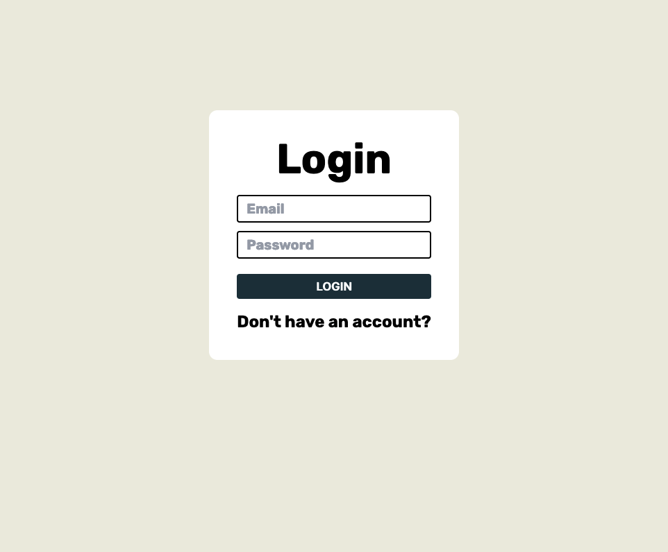

## lsd

This is a starter project for building web apps, built with [Next.js](https://nextjs.org/) and [Supabase](https://supabase.co).

It includes:

- Authentication
- A Sidebar navigation
- Toasts
- State management
- Database



## Getting Started

First, create an account at Supabase and enter the environment variables in:

```bash
NEXT_PUBLIC_SUPABASE_URL=
NEXT_PUBLIC_SUPABASE_ANON_KEY=
```

Next, create a Supabase project, and then in the SQL Editor of the dashboard, click `New Query`, and run the following scripts:

1. Create all tables

```sql
CREATE TABLE profiles (
  id UUID PRIMARY KEY,
  email TEXT,
  username TEXT,
  created_at TIMESTAMP DEFAULT CURRENT_TIMESTAMP
);

CREATE TABLE charges (
  id UUID PRIMARY KEY DEFAULT uuid_generate_v4(),
  created_at TIMESTAMP WITH TIME ZONE DEFAULT NOW(),
  settled BOOLEAN DEFAULT FALSE,
  amount INT4,
  user_id UUID NOT NULL REFERENCES profiles(id),
  expired BOOLEAN DEFAULT FALSE
);

CREATE TABLE payments (
  id UUID PRIMARY KEY DEFAULT uuid_generate_v4(),
  created_at TIMESTAMP WITH TIME ZONE DEFAULT NOW(),
  user_id UUID NOT NULL REFERENCES profiles(id),
  debit_id UUID,
  debit int8 DEFAULT 0,
  credit int8 DEFAULT 0,
  participant_id UUID NOT NULL REFERENCES profiles(id)
);

CREATE TABLE settlements (
  id UUID PRIMARY KEY DEFAULT uuid_generate_v4(),
  created_at TIMESTAMP WITH TIME ZONE DEFAULT NOW(),
  type TEXT,
  debit INT8 DEFAULT 0,
  credit INT8 DEFAULT 0,
  user_id UUID NOT NULL REFERENCES profiles(id)
);

CREATE TABLE withdrawals (
  id UUID PRIMARY KEY DEFAULT uuid_generate_v4(),
  created_at TIMESTAMP WITH TIME ZONE DEFAULT NOW(),
  amount INT8,
  ln_address TEXT,
  user_id UUID NOT NULL REFERENCES profiles(id),
  settled BOOLEAN DEFAULT FALSE
);

```

2. Create all Functions

```sql
CREATE FUNCTION create_profile_on_user_insert()
RETURNS TRIGGER SECURITY DEFINER AS $$
BEGIN
  INSERT INTO public.profiles (id, email)
  VALUES (NEW.id, NEW.email);
  RETURN NEW;
END;
$$ LANGUAGE plpgsql;

CREATE TRIGGER create_profile_trigger
AFTER INSERT ON auth.users
FOR EACH ROW
EXECUTE FUNCTION create_profile_on_user_insert();

```

This will instruct the Supabase DB to create a `profiles` table, and when a user is authenticated, to automatically create a row in the profiles table

Then, run the development server:

```bash
npm run dev
# or
yarn dev
```
