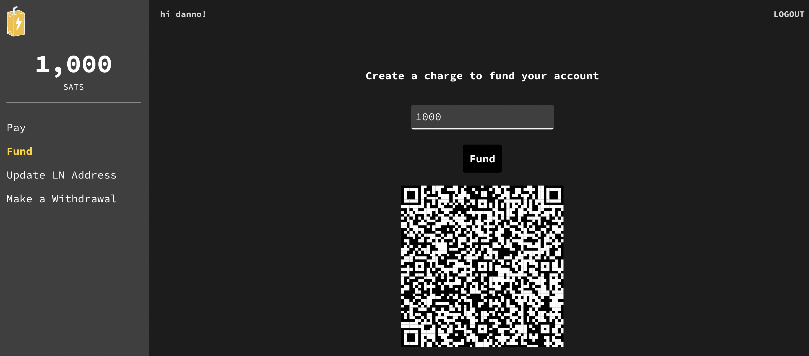

# JuiceBox

An easy Bitcoin Lightning Network web app template using [Supabase](http://supabase.com) and [ZEBEDEE](http://zebedee.io)



- Authentication (Supabase)
- Lightning Network API (Supabase Edge Functions and ZEBEDEE)
- Database (Supabase)
- State management (Mobx)

## Running JuiceBox

### Create accounts

Create accounts at [Supabase](http://supabase.com) and [ZEBEDEE](http://zebedee.io).

Create a new project on Supabase.

### Clone the repository

run `npm start` / `yarn` to initiate the project.

### Get a ZEBEDEE account

Sign up to https://dashboard.zebedee.io.

### Create an `.env` file

add the following variables

```
    REACT_APP_SUPABASE_URL=yourUrlHere
    REACT_APP_SUPABASE_KEY=yourKeyHere
```

### Create another `.env` file inside the `supabase` directory

add the following variables

```
    ZEBEDEE_KEY=yourZebedeeApiKey
```

### Supabase Database Functions

- TODO: Function to add user to table on auth

### Init Supabase Functions

The LNPay API is interacted with through Supabase Edge Functions. To setup and deploy the functions, first install [Supabase CLI](https://supabase.com/docs/guides/cli).

Login to supabase with `supabase login` and enter your access key located in your Supabase account preferences -> Access Tokens -> Generate New Token

Link your project with `supabase link --project-ref your-project-ref` (replace `your-project-ref` with the reference code found on your Supabase project dashboard)

Deploy the edge functions to your Supabase project with `supabase functions deploy create-charge`. (Repeat this step for all of the Edge Functions).

Readme Todos

- Guide on database functions/triggers
